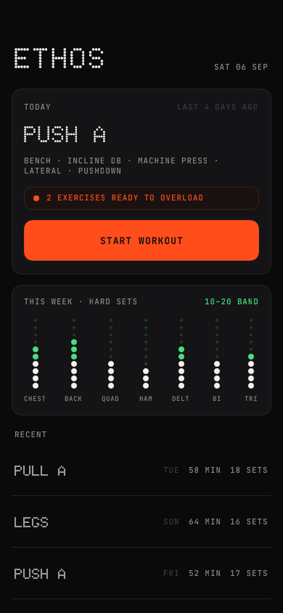
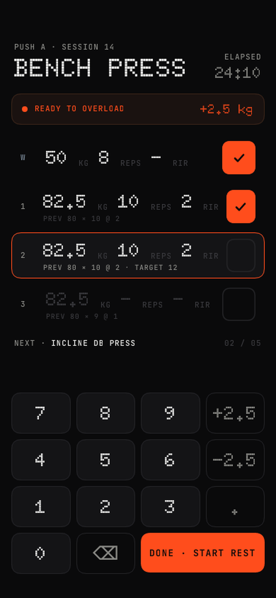

# Ethos

Personal workout tracker for iPhone. Dot-matrix readout, one orange accent, nothing else.

Built for one person, one gym bag. Logs sets fast, suggests the next weight, buzzes when rest is over with the phone locked in a pocket. Offline, SQLite, no account.

 

## What it does

- **Routines** are plans (UL, PPL). Each holds days (Day A, Day B). Days hold exercises with target sets.
- **Preview then start.** Reorder, swap, add, remove exercises before or during a session.
- **Logging.** Custom numpad, kg → reps → RIR in one flow, previous session inline, swipe a set to remove, swipe down for next exercise.
- **Double progression.** Hit the top of the rep range on every set at RIR ≥ 1, next session pre-fills +increment. Three stalls, it suggests a deload.
- **Rest timer** as a local notification plus haptic. Survives backgrounding.
- **Moves** library grouped by movement, variants per equipment and machine brand. Each variant keeps its own history and est. 1RM trend.
- **Home** carousel: weekly hard sets per muscle against the 10–20 band, training days grid.
- **History** with edit and delete. **Backup** to JSON via the share sheet, restore from Files.
- Dark and light.

## Stack

Expo SDK 57, Expo Router, TypeScript, expo-sqlite, Zustand, Reanimated, plain StyleSheet. Everything runs in Expo Go. `bun` only.

## Run

```
bun install
bunx expo start --tunnel
```

Scan with Expo Go on iPhone.

```
bun test            # schema and logic tests via bun:sqlite
bunx tsc --noEmit
```

## Install as a real app

No Mac needed. The `iOS unsigned IPA` GitHub Action runs `expo prebuild` and `xcodebuild` with signing off and uploads `Ethos.ipa`. Sideload it with SideStore or AltStore on a free Apple ID.

## Import from Daily Strength

```
bun scripts/import-daily-strength.ts <backup-folder> out.json
```

Restore `out.json` through Settings. Sessions, sets, exercises and custom plans come across.

## Design

Doto for numbers and titles, JetBrains Mono for labels, warm off-black and off-white, dot graphics carry the data. Mockups in `docs/design/`.
